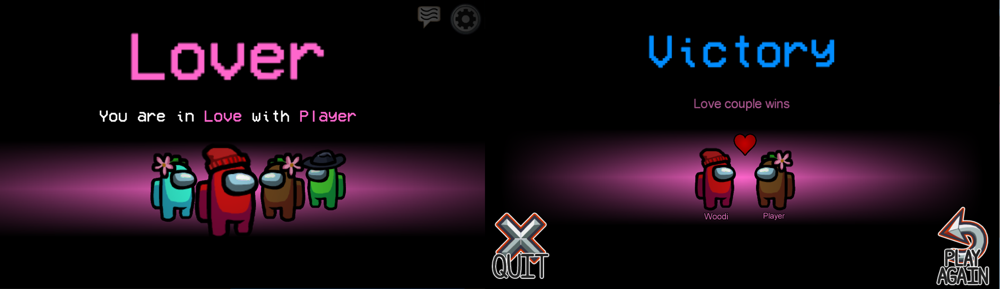

# Love Couple Mod
Love Couple is an Among Us modification, which adds a new win condition for two randomly chosen players.
</img>

<h3>What does the Love Couple do?</h3>
The primary objective of the Love Couple is to stay alive together. If they are among the last 3 players they win.
They can win as an Impostor or Crewmate as well (secondary objective).
<h3>Additional Features</h3>
<ul>
<li> Both lovers die together option can be set</li>
 <li> Both lovers can chat during the game </li>
<li> Playable on public Among Us Servers</li>
<li> Custom server regions to join private servers</li>
</ul>

<h2> Installation </h2>
<ul>
<li>Download the Mod for your specific game version. You are not able to launch the game if the versions do not match.</li>
<li>Make a copy of your game’s root directory (Steam/steamapps/common/Among Us) and rename it to whatever you want (Steam/steamapps/common/Among Us Love Couple Mod) </li>
<li>Extract the content of Among Us Love Couple Mod.zip into the copied folder you created</li>
<li>Open your modded folder and open the Game via Among Us.exe</li>
</ul>
 
<h2>Releases and Compatibility</h2>
 
 <table style="width:100%">
  <tr>
    <th>Among Us Version</th>
    <th>Mod Version</th>
    <th>Link</th>
  </tr>

  <tr>
    <td>v2020.12.9s</td>
    <td>v1.0</td>
    <td><a href="https://github.com/Woodi-dev/Sheriff-Mod/releases/download/v2020.12.9s/Among.Us.Sheriff.Mod.1.01.zip">Download</></td>
  </tr>

</table>

  
Changelog

  

Check out Love Couple Mod on CurseForge: <a href="https://www.curseforge.com/among-us/mods/sheriff-mod">https://www.curseforge.com/among-us/mods/sheriff-mod</a>
<h2>Q&A</h2>

<b>How is the Love Couple determined?</b> 
There are two types of Love Couples. With a probability of 66.6% the pair consists of two Crewmates.  The second type comes with a chance of 33.3% which pairs an Impostor with a Crewmate.

<b>What does happen in this situation (Imposter + Crewmate, Impostor, Crewmate)?</b> 
The game does <b>not</b> end. Depending on the next kill the Love Couple or Impostors win

<b>Can you play Proximity Chat (Crewlink) with it?</b> 
Yes Crewlink does support Among Us Modifications.

<b>Can you get banned for playing on public servers?</b> 
At the current state of the game there is no perma ban system. The mod is designed in a way, that it does not send prohibited server requests.
You are also able to join your own custom server to be safe <a href="https://github.com/Impostor/Impostor">(Impostor)</a>

<b>How can i join a custom server?</b> 
Go to your game directory and open BepInEx/config/org.bepinex.plugins.CustomServer.txt. There you can set the hostname or IP of the server. Then set the server region to CUSTOM.

<b>Do my friends need to install the mod to play it together?</b> 
Yes. Every player in the game lobby has to install it.

<h2>Donate</h2>

<a href="https://www.paypal.com/donate?hosted_button_id=TWGK7A9VBVPRU"></img></a>

I would appreciate any donations. This will help me to develop more mods.

For exclusive modding requests contact me: <a href="mailto:Woodi-dev@gmx.de">Woodi-dev@gmx.de</a>
<h2>License</h2>

This software is distributed under the <b>CC Attribution-NoDerivatives 4.0</b> License.
<a href="https://github.com/BepInEx/BepInEx">BepinEx</a> is distributed under <b>LGPL-2.1</b> License.

